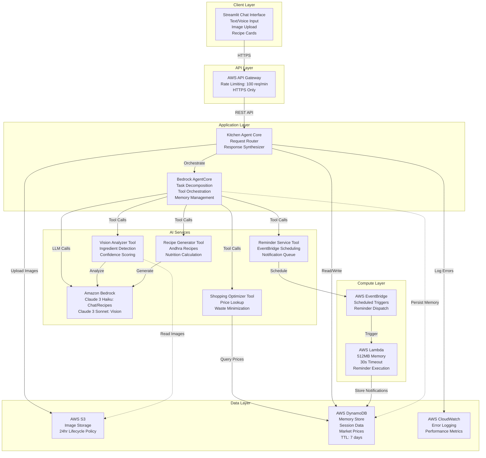
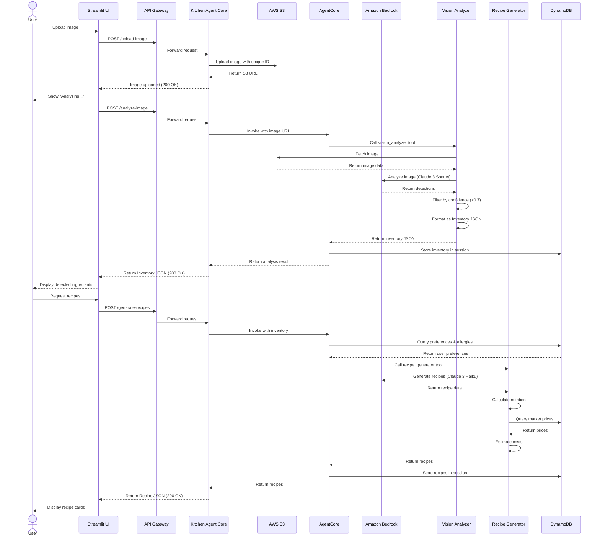
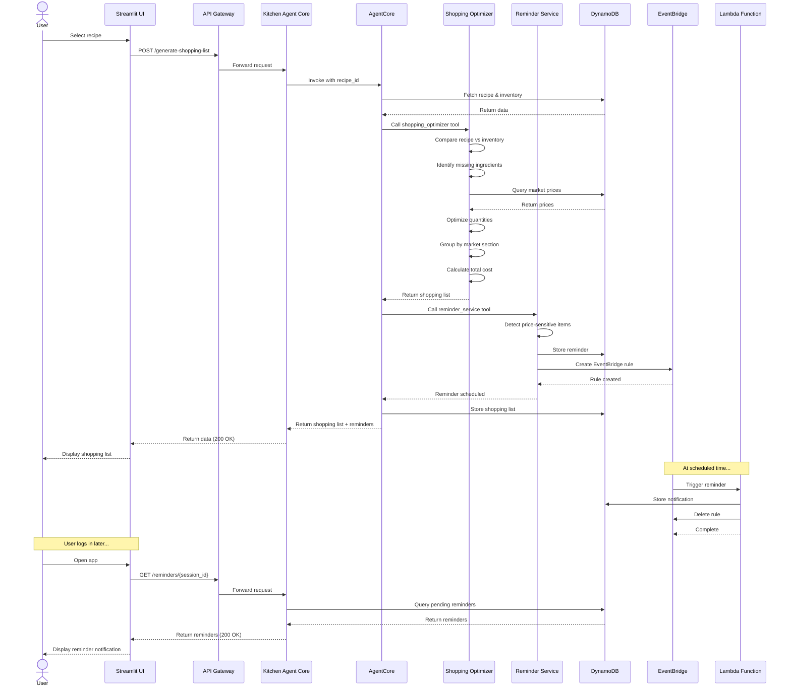
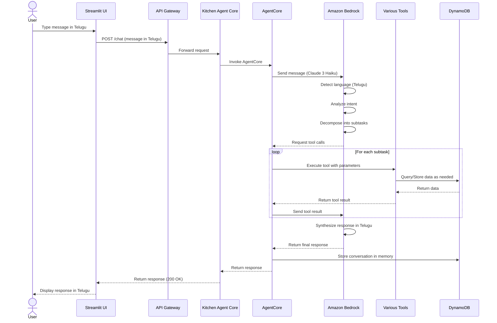
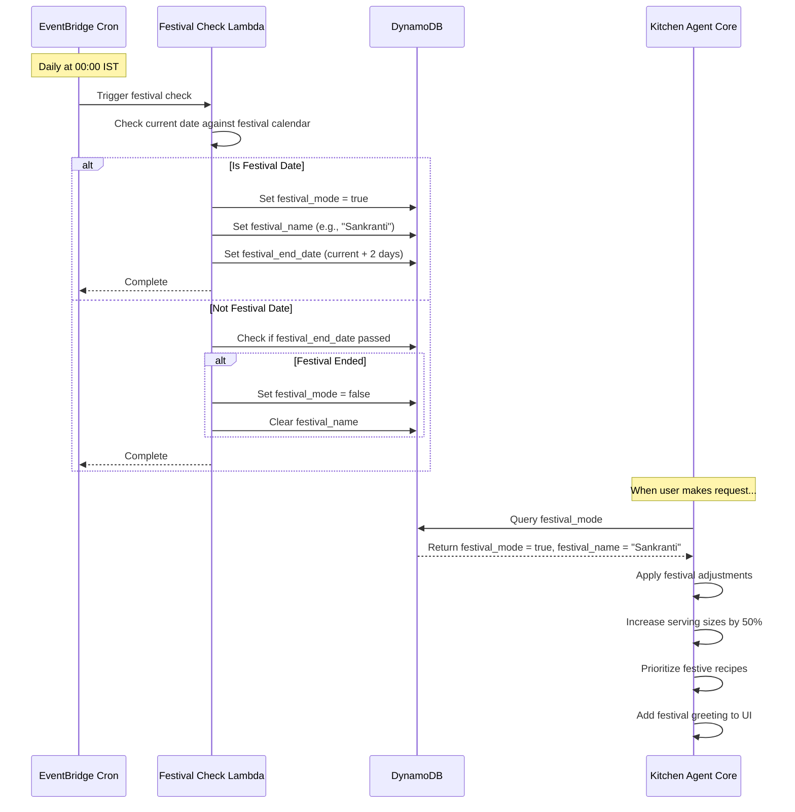
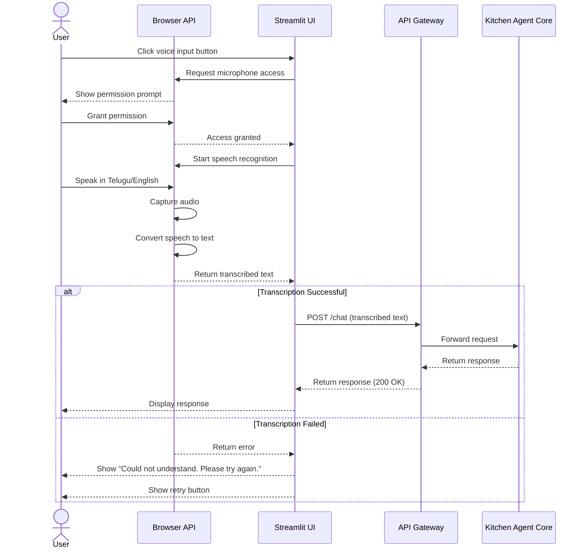

# Design Document: Andhra Kitchen Agent

## Overview

The Andhra Kitchen Agent is a multilingual AI-powered kitchen assistant that helps families in Andhra Pradesh manage their kitchen inventory, discover nutritious recipes, and optimize grocery shopping. The system leverages Amazon Bedrock for AI capabilities, with Bedrock AgentCore orchestrating autonomous workflows including vision analysis, recipe generation, shopping optimization, and proactive reminders.

### Key Features

- Multilingual chat interface (English/Telugu) with voice input support
- Computer vision-based ingredient detection from fridge/pantry photos
- Autonomous workflow decomposition and task orchestration via Bedrock AgentCore
- Personalized recipe generation based on available ingredients and family preferences
- Shopping list optimization with Vijayawada market prices
- Proactive reminder service for optimal shopping times
- Festival mode for Telugu celebrations (Sankranti, Ugadi, Dasara, Deepavali)
- Memory management for dietary preferences and allergies

### Design Goals

- AWS Free Tier compliance for cost-effective operation
- Fast response times (chat: 3s, vision: 10s, recipes: 15s)
- Mobile-responsive interface (360px+ width)
- Support for 10 concurrent users
- 99% uptime during business hours (6 AM - 11 PM IST)

## Architecture

### System Architecture Diagram



### Architecture Layers

**Client Layer**: Streamlit-based web interface providing chat, voice input, image upload, and recipe display capabilities. Responsive design supports mobile browsers (360px+ width).

**API Layer**: AWS API Gateway serves as the entry point, enforcing HTTPS, rate limiting (100 req/min per user), and routing requests to the application layer.

**Application Layer**: 
- Kitchen Agent Core handles request routing, response synthesis, and coordinates with AWS services
- Bedrock AgentCore decomposes user requests into subtasks, orchestrates tool calls, and manages conversation memory

**AI Services**: Amazon Bedrock provides LLM capabilities through Claude 3 models. Four specialized tools implement core functionality:
- Vision Analyzer: Detects ingredients from images with confidence scoring
- Recipe Generator: Creates Andhra-style recipes with nutrition information
- Shopping Optimizer: Generates optimized shopping lists with market prices
- Reminder Service: Schedules proactive notifications

**Data Layer**:
- S3: Stores uploaded images with 24-hour lifecycle policy
- DynamoDB: Persists memory store, session data, market prices, and reminders with 7-day TTL
- CloudWatch: Logs errors and tracks performance metrics

**Compute Layer**: AWS Lambda functions execute scheduled reminders triggered by EventBridge, with 512MB memory and 30-second timeout limits.


## Components and Interfaces

### 1. Streamlit Chat Interface

**Responsibilities**:
- Render chat UI with message history
- Capture text, voice, and image inputs
- Display recipes, shopping lists, and reminders
- Handle language switching (English/Telugu)
- Manage browser-based speech recognition

**Key Interfaces**:
```python
class ChatInterface:
    def render_chat_history(messages: List[Message]) -> None
    def capture_text_input() -> str
    def capture_voice_input() -> str  # Uses browser Speech Recognition API
    def upload_image() -> UploadedFile
    def display_recipe_card(recipe: Recipe) -> None
    def display_shopping_list(items: List[ShoppingItem]) -> None
    def toggle_language(lang: str) -> None  # 'en' or 'te'
```

**Technology Stack**:
- Streamlit 1.28+
- Browser Speech Recognition API (Web Speech API)
- Streamlit file uploader for images
- Custom CSS for mobile responsiveness

**Error Handling**:
- Display user-friendly error messages in selected language
- Provide retry buttons for failed operations
- Show loading indicators during API calls

---

### 2. Kitchen Agent Core

**Responsibilities**:
- Route incoming requests to appropriate handlers
- Manage S3 image uploads with pre-signed URLs
- Coordinate with Bedrock AgentCore
- Synthesize responses from multiple tool outputs
- Handle session management
- Implement retry logic with exponential backoff

**Key Interfaces**:
```python
class KitchenAgentCore:
    def process_chat_message(session_id: str, message: str, language: str) -> Response
    def upload_image_to_s3(image: bytes, session_id: str) -> str  # Returns S3 URL
    def invoke_agentcore(session_id: str, prompt: str, context: Dict) -> AgentResponse
    def synthesize_response(tool_outputs: List[ToolOutput]) -> str
    def get_session(session_id: str) -> Session
    def create_session() -> str  # Returns new session_id
```

**Configuration**:
- AWS region: ap-south-1 (Mumbai, closest to Andhra Pradesh)
- S3 bucket: kitchen-agent-images-{account-id}
- DynamoDB table: kitchen-agent-sessions
- API Gateway endpoint: /api/v1/chat

**Retry Strategy**:
- Exponential backoff: 1s, 2s, 4s
- Maximum 3 retries for Bedrock API calls
- Circuit breaker pattern for persistent failures

---

### 3. Bedrock AgentCore

**Responsibilities**:
- Decompose user requests into subtasks
- Determine optimal tool execution order
- Execute tool calls with proper parameters
- Manage conversation memory across sessions
- Pass tool outputs back to Bedrock for synthesis

**Key Interfaces**:
```python
class BedrockAgentCore:
    def decompose_task(user_request: str, memory: Memory) -> List[Subtask]
    def execute_workflow(subtasks: List[Subtask]) -> WorkflowResult
    def call_tool(tool_name: str, parameters: Dict) -> ToolOutput
    def store_memory(session_id: str, key: str, value: Any) -> None
    def retrieve_memory(session_id: str, key: str) -> Any
    def register_tool(tool: Tool) -> None
```

**Tool Registration**:
Each tool must provide:
- Tool name and description
- Parameter schema (JSON Schema format)
- Execution function

**Memory Management**:
- Short-term memory: Current conversation context (in-memory)
- Long-term memory: Preferences, allergies, history (DynamoDB)
- Memory retrieval: Semantic search for relevant past interactions

---

### 4. Vision Analyzer Tool

**Responsibilities**:
- Analyze uploaded images using Bedrock Claude 3 Sonnet
- Detect Andhra ingredients with quantity estimation
- Assign confidence scores (0-1 scale)
- Generate structured Inventory JSON
- Filter results by confidence threshold (0.7+)

**Key Interfaces**:
```python
class VisionAnalyzer:
    def analyze_image(s3_url: str) -> InventoryJSON
    def detect_ingredients(image_data: bytes) -> List[DetectedIngredient]
    def estimate_quantity(ingredient: str, visual_cues: Dict) -> Quantity
    def calculate_confidence(detection_data: Dict) -> float
    def format_inventory_json(detections: List[DetectedIngredient]) -> InventoryJSON
```

**Bedrock Configuration**:
- Model: anthropic.claude-3-sonnet-20240229-v1:0
- Max tokens: 2048
- Temperature: 0.3 (lower for more consistent detection)
- Vision prompt template: "Identify all Andhra cuisine ingredients visible in this image. For each ingredient, estimate the quantity and your confidence level."

**Confidence Thresholds**:
- High (0.7-1.0): Include in inventory automatically
- Medium (0.5-0.7): Ask user for confirmation
- Low (0.0-0.5): Exclude from inventory

---

### 5. Recipe Generator Tool

**Responsibilities**:
- Generate Andhra-style recipes using available ingredients
- Query memory for dietary preferences and allergies
- Calculate nutrition information (calories, protein, carbs, fat, fiber)
- Estimate recipe cost based on Vijayawada market prices
- Format recipes with numbered steps
- Support multilingual output (English/Telugu)

**Key Interfaces**:
```python
class RecipeGenerator:
    def generate_recipes(inventory: InventoryJSON, preferences: Preferences, 
                        language: str, count: int = 3) -> List[Recipe]
    def calculate_nutrition(ingredients: List[Ingredient], 
                           cooking_method: str) -> NutritionInfo
    def estimate_cost(ingredients: List[Ingredient], 
                     market_prices: Dict) -> float
    def format_recipe(recipe_data: Dict, language: str) -> Recipe
    def apply_low_oil_optimization(recipe: Recipe) -> Recipe
```

**Bedrock Configuration**:
- Model: anthropic.claude-3-haiku-20240307-v1:0
- Max tokens: 4096
- Temperature: 0.7 (balanced creativity and consistency)
- System prompt: "You are an expert in Andhra Pradesh cuisine. Generate authentic, nutritious recipes using traditional cooking methods."

**Recipe Constraints**:
- Preparation time: Prioritize recipes under 30 minutes
- Serving size: Default 4 servings (increase 50% during festivals)
- Oil usage: Max 2 tablespoons per serving for low-oil preference
- Recipe count: 2-5 options per request

**Nutrition Data Sources**:
- USDA FoodData Central for common ingredients
- IFCT (Indian Food Composition Tables) for Indian-specific items
- Cooking method adjustments (e.g., +20% fat for deep frying)

---

### 6. Shopping Optimizer Tool

**Responsibilities**:
- Compare recipe requirements against current inventory
- Identify missing ingredients
- Query DynamoDB for Vijayawada market prices
- Optimize quantities to minimize waste
- Group items by market section
- Calculate total estimated cost

**Key Interfaces**:
```python
class ShoppingOptimizer:
    def generate_shopping_list(recipe: Recipe, inventory: InventoryJSON) -> ShoppingList
    def identify_missing_ingredients(required: List[Ingredient], 
                                    available: List[Ingredient]) -> List[Ingredient]
    def get_market_prices(ingredients: List[str]) -> Dict[str, Price]
    def optimize_quantities(ingredient: str, required_qty: float) -> OptimizedQuantity
    def group_by_section(items: List[ShoppingItem]) -> Dict[str, List[ShoppingItem]]
    def calculate_total_cost(items: List[ShoppingItem]) -> float
```

**Market Price Management**:
- DynamoDB table: kitchen-agent-market-prices
- Schema: {ingredient_name, price_per_unit, unit, market_name, last_updated}
- Update frequency: Manual updates or crowdsourced data
- Fallback: Estimate based on similar ingredients

**Quantity Optimization Rules**:
- Round up to common package sizes (e.g., 250g, 500g, 1kg)
- Suggest smaller quantities for perishables
- Consider shelf life in recommendations

**Market Sections**:
- Vegetables & Fruits
- Grains & Pulses
- Spices & Condiments
- Dairy & Eggs
- Meat & Fish

---

### 7. Reminder Service Tool

**Responsibilities**:
- Schedule reminders for optimal shopping times
- Detect price-sensitive ingredients
- Create EventBridge rules for scheduled triggers
- Store reminder content in DynamoDB
- Deliver reminders via chat interface on next login

**Key Interfaces**:
```python
class ReminderService:
    def schedule_reminder(session_id: str, content: str, 
                         trigger_time: datetime, reason: str) -> str  # Returns reminder_id
    def create_eventbridge_rule(reminder_id: str, trigger_time: datetime) -> None
    def store_reminder(reminder: Reminder) -> None
    def get_pending_reminders(session_id: str) -> List[Reminder]
    def dismiss_reminder(reminder_id: str) -> None
    def snooze_reminder(reminder_id: str, duration: timedelta) -> None
```

**EventBridge Integration**:
- Rule naming: kitchen-agent-reminder-{reminder_id}
- Target: Lambda function (ReminderExecutor)
- Payload: {reminder_id, session_id, content, reason}

**Lambda Function (ReminderExecutor)**:
```python
def lambda_handler(event, context):
    reminder_id = event['reminder_id']
    session_id = event['session_id']
    
    # Store notification in DynamoDB for next user login
    store_notification(session_id, event['content'], event['reason'])
    
    # Clean up EventBridge rule
    delete_eventbridge_rule(f"kitchen-agent-reminder-{reminder_id}")
    
    return {'statusCode': 200}
```

**Reminder Triggers**:
- Price-sensitive ingredients (e.g., "Curry leaves cheaper on Wednesdays")
- Festival preparation (e.g., "Sankranti in 3 days - buy jaggery")
- Expiring inventory (future enhancement)


## Data Models

### Inventory JSON Schema

```json
{
  "$schema": "http://json-schema.org/draft-07/schema#",
  "type": "object",
  "required": ["total_items", "detection_timestamp", "ingredients"],
  "properties": {
    "total_items": {
      "type": "integer",
      "minimum": 0,
      "description": "Total count of detected ingredients"
    },
    "detection_timestamp": {
      "type": "string",
      "format": "date-time",
      "description": "ISO 8601 timestamp of detection"
    },
    "session_id": {
      "type": "string",
      "description": "User session identifier"
    },
    "ingredients": {
      "type": "array",
      "items": {
        "type": "object",
        "required": ["ingredient_name", "quantity", "unit", "confidence_score"],
        "properties": {
          "ingredient_name": {
            "type": "string",
            "description": "English name of ingredient"
          },
          "ingredient_name_telugu": {
            "type": "string",
            "description": "Telugu name of ingredient (optional)"
          },
          "quantity": {
            "type": "number",
            "minimum": 0,
            "description": "Estimated quantity"
          },
          "unit": {
            "type": "string",
            "enum": ["kg", "grams", "pieces", "bunches", "liters", "ml", "cups"],
            "description": "Unit of measurement"
          },
          "confidence_score": {
            "type": "number",
            "minimum": 0,
            "maximum": 1,
            "description": "Detection confidence (0-1)"
          },
          "category": {
            "type": "string",
            "enum": ["vegetable", "fruit", "grain", "pulse", "spice", "dairy", "meat", "other"],
            "description": "Ingredient category"
          }
        }
      }
    }
  }
}
```

**Example**:
```json
{
  "total_items": 4,
  "detection_timestamp": "2024-01-15T10:30:00Z",
  "session_id": "sess_abc123",
  "ingredients": [
    {
      "ingredient_name": "brinjal",
      "ingredient_name_telugu": "వంకాయ",
      "quantity": 3,
      "unit": "pieces",
      "confidence_score": 0.92,
      "category": "vegetable"
    },
    {
      "ingredient_name": "curry_leaves",
      "ingredient_name_telugu": "కరివేపాకు",
      "quantity": 1,
      "unit": "bunches",
      "confidence_score": 0.88,
      "category": "spice"
    },
    {
      "ingredient_name": "rice",
      "ingredient_name_telugu": "బియ్యం",
      "quantity": 2,
      "unit": "kg",
      "confidence_score": 0.95,
      "category": "grain"
    },
    {
      "ingredient_name": "tamarind",
      "ingredient_name_telugu": "చింతపండు",
      "quantity": 100,
      "unit": "grams",
      "confidence_score": 0.78,
      "category": "spice"
    }
  ]
}
```

---

### Recipe JSON Schema

```json
{
  "$schema": "http://json-schema.org/draft-07/schema#",
  "type": "object",
  "required": ["recipe_id", "name", "ingredients", "steps", "prep_time", "servings", "nutrition"],
  "properties": {
    "recipe_id": {
      "type": "string",
      "description": "Unique recipe identifier"
    },
    "name": {
      "type": "string",
      "description": "Recipe name in selected language"
    },
    "name_english": {
      "type": "string"
    },
    "name_telugu": {
      "type": "string"
    },
    "description": {
      "type": "string",
      "description": "Brief recipe description"
    },
    "prep_time": {
      "type": "integer",
      "description": "Preparation time in minutes"
    },
    "cook_time": {
      "type": "integer",
      "description": "Cooking time in minutes"
    },
    "total_time": {
      "type": "integer",
      "description": "Total time in minutes"
    },
    "servings": {
      "type": "integer",
      "minimum": 1,
      "description": "Number of servings"
    },
    "difficulty": {
      "type": "string",
      "enum": ["easy", "medium", "hard"]
    },
    "ingredients": {
      "type": "array",
      "items": {
        "type": "object",
        "required": ["name", "quantity", "unit"],
        "properties": {
          "name": {
            "type": "string"
          },
          "quantity": {
            "type": "number"
          },
          "unit": {
            "type": "string"
          },
          "optional": {
            "type": "boolean",
            "default": false
          }
        }
      }
    },
    "steps": {
      "type": "array",
      "items": {
        "type": "object",
        "required": ["step_number", "instruction"],
        "properties": {
          "step_number": {
            "type": "integer"
          },
          "instruction": {
            "type": "string"
          },
          "duration": {
            "type": "integer",
            "description": "Step duration in minutes (optional)"
          }
        }
      }
    },
    "nutrition": {
      "type": "object",
      "required": ["calories", "protein", "carbohydrates", "fat"],
      "properties": {
        "calories": {
          "type": "number",
          "description": "Calories per serving"
        },
        "protein": {
          "type": "number",
          "description": "Protein in grams per serving"
        },
        "carbohydrates": {
          "type": "number",
          "description": "Carbohydrates in grams per serving"
        },
        "fat": {
          "type": "number",
          "description": "Fat in grams per serving"
        },
        "fiber": {
          "type": "number",
          "description": "Fiber in grams per serving"
        },
        "accuracy_margin": {
          "type": "string",
          "default": "±10%"
        }
      }
    },
    "estimated_cost": {
      "type": "number",
      "description": "Estimated cost in INR for all servings"
    },
    "cost_per_serving": {
      "type": "number",
      "description": "Cost in INR per serving"
    },
    "cooking_method": {
      "type": "string",
      "enum": ["steaming", "boiling", "frying", "grilling", "baking", "pressure_cooking", "sauteing"]
    },
    "oil_quantity": {
      "type": "number",
      "description": "Oil in tablespoons per serving"
    },
    "tags": {
      "type": "array",
      "items": {
        "type": "string"
      },
      "description": "Tags like 'low-oil', 'festival', 'quick', 'vegetarian'"
    },
    "allergen_info": {
      "type": "array",
      "items": {
        "type": "string"
      },
      "description": "List of common allergens present"
    }
  }
}
```

**Example**:
```json
{
  "recipe_id": "recipe_vankaya_curry_001",
  "name": "వంకాయ కూర",
  "name_english": "Brinjal Curry",
  "name_telugu": "వంకాయ కూర",
  "description": "Traditional Andhra-style brinjal curry with tamarind and spices",
  "prep_time": 10,
  "cook_time": 20,
  "total_time": 30,
  "servings": 4,
  "difficulty": "easy",
  "ingredients": [
    {"name": "brinjal", "quantity": 3, "unit": "pieces"},
    {"name": "tamarind", "quantity": 50, "unit": "grams"},
    {"name": "curry_leaves", "quantity": 10, "unit": "pieces"},
    {"name": "oil", "quantity": 2, "unit": "tablespoons"},
    {"name": "mustard_seeds", "quantity": 1, "unit": "teaspoon"},
    {"name": "turmeric", "quantity": 0.5, "unit": "teaspoon"},
    {"name": "red_chili_powder", "quantity": 1, "unit": "teaspoon"},
    {"name": "salt", "quantity": 1, "unit": "teaspoon"}
  ],
  "steps": [
    {"step_number": 1, "instruction": "Cut brinjals into medium pieces and soak in water", "duration": 5},
    {"step_number": 2, "instruction": "Heat oil in a pan and add mustard seeds", "duration": 2},
    {"step_number": 3, "instruction": "Add curry leaves and turmeric", "duration": 1},
    {"step_number": 4, "instruction": "Add brinjal pieces and sauté for 5 minutes", "duration": 5},
    {"step_number": 5, "instruction": "Add tamarind paste, chili powder, salt, and water", "duration": 2},
    {"step_number": 6, "instruction": "Cover and cook until brinjals are tender", "duration": 10}
  ],
  "nutrition": {
    "calories": 120,
    "protein": 2.5,
    "carbohydrates": 15,
    "fat": 6,
    "fiber": 4,
    "accuracy_margin": "±10%"
  },
  "estimated_cost": 40,
  "cost_per_serving": 10,
  "cooking_method": "sauteing",
  "oil_quantity": 0.5,
  "tags": ["low-oil", "vegetarian", "quick", "traditional"],
  "allergen_info": []
}
```

---

### Shopping List Schema

```json
{
  "$schema": "http://json-schema.org/draft-07/schema#",
  "type": "object",
  "required": ["list_id", "recipe_id", "items", "total_cost"],
  "properties": {
    "list_id": {
      "type": "string",
      "description": "Unique shopping list identifier"
    },
    "recipe_id": {
      "type": "string",
      "description": "Associated recipe identifier"
    },
    "session_id": {
      "type": "string"
    },
    "created_at": {
      "type": "string",
      "format": "date-time"
    },
    "items": {
      "type": "array",
      "items": {
        "type": "object",
        "required": ["ingredient_name", "quantity", "unit", "estimated_price"],
        "properties": {
          "ingredient_name": {
            "type": "string"
          },
          "quantity": {
            "type": "number"
          },
          "unit": {
            "type": "string"
          },
          "estimated_price": {
            "type": "number",
            "description": "Price in INR"
          },
          "market_section": {
            "type": "string",
            "enum": ["vegetables", "fruits", "grains", "pulses", "spices", "dairy", "meat", "other"]
          },
          "optimized_quantity": {
            "type": "number",
            "description": "Suggested quantity to minimize waste"
          },
          "optimized_unit": {
            "type": "string"
          },
          "price_last_updated": {
            "type": "string",
            "format": "date-time"
          },
          "checked": {
            "type": "boolean",
            "default": false
          }
        }
      }
    },
    "total_cost": {
      "type": "number",
      "description": "Total estimated cost in INR"
    },
    "grouped_by_section": {
      "type": "object",
      "description": "Items grouped by market section"
    }
  }
}
```

**Example**:
```json
{
  "list_id": "list_abc123",
  "recipe_id": "recipe_vankaya_curry_001",
  "session_id": "sess_abc123",
  "created_at": "2024-01-15T10:35:00Z",
  "items": [
    {
      "ingredient_name": "mustard_seeds",
      "quantity": 1,
      "unit": "teaspoon",
      "estimated_price": 5,
      "market_section": "spices",
      "optimized_quantity": 50,
      "optimized_unit": "grams",
      "price_last_updated": "2024-01-10T00:00:00Z",
      "checked": false
    },
    {
      "ingredient_name": "red_chili_powder",
      "quantity": 1,
      "unit": "teaspoon",
      "estimated_price": 8,
      "market_section": "spices",
      "optimized_quantity": 100,
      "optimized_unit": "grams",
      "price_last_updated": "2024-01-10T00:00:00Z",
      "checked": false
    }
  ],
  "total_cost": 13,
  "grouped_by_section": {
    "spices": [
      {"ingredient_name": "mustard_seeds", "quantity": 50, "unit": "grams", "price": 5},
      {"ingredient_name": "red_chili_powder", "quantity": 100, "unit": "grams", "price": 8}
    ]
  }
}
```

---

### Memory Store Schema (DynamoDB)

**Table: kitchen-agent-sessions**

```
Partition Key: session_id (String)
Sort Key: data_type (String)  # Values: 'profile', 'preference', 'allergy', 'history'
TTL: expiry_timestamp (Number)  # 7 days from last access

Attributes:
- session_id: String (PK)
- data_type: String (SK)
- user_language: String ('en' or 'te')
- preferences: Map
  - low_oil: Boolean
  - vegetarian: Boolean
  - spice_level: String ('mild', 'medium', 'hot')
  - favorite_dishes: List<String>
- allergies: List<String>
- allergy_priority: String ('high')
- conversation_history: List<Map>
  - timestamp: String
  - user_message: String
  - agent_response: String
- last_inventory: Map (Inventory JSON)
- last_recipes: List<Map> (Recipe JSON)
- created_at: String (ISO 8601)
- updated_at: String (ISO 8601)
- expiry_timestamp: Number (Unix timestamp)
```

**Table: kitchen-agent-market-prices**

```
Partition Key: ingredient_name (String)
Sort Key: market_name (String)

Attributes:
- ingredient_name: String (PK)
- market_name: String (SK)  # e.g., 'vijayawada_gandhi_nagar', 'vijayawada_benz_circle'
- price_per_unit: Number
- unit: String
- last_updated: String (ISO 8601)
- source: String ('manual', 'crowdsourced', 'estimated')
- confidence: Number (0-1)
```

**Table: kitchen-agent-reminders**

```
Partition Key: session_id (String)
Sort Key: reminder_id (String)
TTL: expiry_timestamp (Number)  # 7 days

Attributes:
- session_id: String (PK)
- reminder_id: String (SK)
- content: String
- reason: String
- trigger_time: String (ISO 8601)
- status: String ('pending', 'delivered', 'dismissed', 'snoozed')
- created_at: String (ISO 8601)
- eventbridge_rule_name: String
- expiry_timestamp: Number
```


## API Specifications

### REST API Endpoints

**Base URL**: `https://api.kitchen-agent.example.com/api/v1`

All endpoints require HTTPS and return JSON responses.

---

#### 1. POST /chat

Send a text message to the Kitchen Agent.

**Request**:
```json
{
  "session_id": "sess_abc123",
  "message": "What can I cook with brinjal?",
  "language": "en",
  "context": {
    "has_inventory": false,
    "last_recipe_id": null
  }
}
```

**Response** (200 OK):
```json
{
  "session_id": "sess_abc123",
  "response": "I can suggest several delicious Andhra-style brinjal recipes! Would you like me to see what other ingredients you have? You can upload a photo of your fridge or pantry.",
  "language": "en",
  "suggested_actions": [
    {"type": "upload_image", "label": "Upload photo"},
    {"type": "text_input", "label": "Tell me what you have"}
  ],
  "timestamp": "2024-01-15T10:30:00Z"
}
```

**Error Response** (400 Bad Request):
```json
{
  "error": "invalid_request",
  "message": "Missing required field: session_id",
  "timestamp": "2024-01-15T10:30:00Z"
}
```

**Rate Limit** (429 Too Many Requests):
```json
{
  "error": "rate_limit_exceeded",
  "message": "Too many requests. Please try again later.",
  "retry_after": 60,
  "timestamp": "2024-01-15T10:30:00Z"
}
```

---

#### 2. POST /upload-image

Upload an image for ingredient detection.

**Request** (multipart/form-data):
```
session_id: sess_abc123
image: [binary file data]
language: en
```

**Response** (200 OK):
```json
{
  "session_id": "sess_abc123",
  "image_id": "img_xyz789",
  "s3_url": "https://kitchen-agent-images.s3.ap-south-1.amazonaws.com/...",
  "status": "uploaded",
  "message": "Image uploaded successfully. Analyzing ingredients...",
  "timestamp": "2024-01-15T10:31:00Z"
}
```

**Error Response** (413 Payload Too Large):
```json
{
  "error": "file_too_large",
  "message": "Image size exceeds 10MB limit",
  "max_size_mb": 10,
  "timestamp": "2024-01-15T10:31:00Z"
}
```

---

#### 3. POST /analyze-image

Trigger ingredient detection on an uploaded image.

**Request**:
```json
{
  "session_id": "sess_abc123",
  "image_id": "img_xyz789",
  "s3_url": "https://...",
  "language": "en"
}
```

**Response** (200 OK):
```json
{
  "session_id": "sess_abc123",
  "image_id": "img_xyz789",
  "inventory": {
    "total_items": 4,
    "detection_timestamp": "2024-01-15T10:31:30Z",
    "ingredients": [
      {
        "ingredient_name": "brinjal",
        "ingredient_name_telugu": "వంకాయ",
        "quantity": 3,
        "unit": "pieces",
        "confidence_score": 0.92,
        "category": "vegetable"
      }
    ]
  },
  "message": "Found 4 ingredients! Would you like recipe suggestions?",
  "timestamp": "2024-01-15T10:31:30Z"
}
```

**Error Response** (422 Unprocessable Entity):
```json
{
  "error": "analysis_failed",
  "message": "Could not analyze image. Please ensure the photo is clear and well-lit.",
  "timestamp": "2024-01-15T10:31:30Z"
}
```

---

#### 4. POST /generate-recipes

Generate recipes based on available ingredients.

**Request**:
```json
{
  "session_id": "sess_abc123",
  "inventory": { /* Inventory JSON */ },
  "preferences": {
    "low_oil": true,
    "vegetarian": true,
    "spice_level": "medium"
  },
  "allergies": ["peanuts"],
  "language": "en",
  "count": 3
}
```

**Response** (200 OK):
```json
{
  "session_id": "sess_abc123",
  "recipes": [
    { /* Recipe JSON 1 */ },
    { /* Recipe JSON 2 */ },
    { /* Recipe JSON 3 */ }
  ],
  "message": "Here are 3 recipe suggestions based on your ingredients!",
  "timestamp": "2024-01-15T10:32:00Z"
}
```

---

#### 5. POST /generate-shopping-list

Generate an optimized shopping list for a recipe.

**Request**:
```json
{
  "session_id": "sess_abc123",
  "recipe_id": "recipe_vankaya_curry_001",
  "current_inventory": { /* Inventory JSON */ },
  "language": "en"
}
```

**Response** (200 OK):
```json
{
  "session_id": "sess_abc123",
  "shopping_list": { /* Shopping List JSON */ },
  "message": "Shopping list ready! Total estimated cost: ₹13",
  "reminders": [
    {
      "content": "Buy fresh curry leaves tomorrow",
      "reason": "Prices are lower on Wednesdays at Gandhi Nagar market",
      "trigger_time": "2024-01-16T08:00:00Z"
    }
  ],
  "timestamp": "2024-01-15T10:33:00Z"
}
```

---

#### 6. GET /session/{session_id}

Retrieve session data including conversation history and preferences.

**Response** (200 OK):
```json
{
  "session_id": "sess_abc123",
  "user_language": "en",
  "preferences": {
    "low_oil": true,
    "vegetarian": true,
    "spice_level": "medium"
  },
  "allergies": ["peanuts"],
  "conversation_history": [
    {
      "timestamp": "2024-01-15T10:30:00Z",
      "user_message": "What can I cook with brinjal?",
      "agent_response": "I can suggest several delicious..."
    }
  ],
  "last_inventory": { /* Inventory JSON */ },
  "created_at": "2024-01-15T10:00:00Z",
  "updated_at": "2024-01-15T10:33:00Z"
}
```

---

#### 7. POST /session

Create a new session.

**Request**:
```json
{
  "language": "en"
}
```

**Response** (201 Created):
```json
{
  "session_id": "sess_abc123",
  "created_at": "2024-01-15T10:00:00Z",
  "expires_at": "2024-01-22T10:00:00Z"
}
```

---

#### 8. GET /reminders/{session_id}

Get pending reminders for a session.

**Response** (200 OK):
```json
{
  "session_id": "sess_abc123",
  "reminders": [
    {
      "reminder_id": "rem_xyz123",
      "content": "Buy fresh curry leaves tomorrow",
      "reason": "Prices are lower on Wednesdays",
      "trigger_time": "2024-01-16T08:00:00Z",
      "status": "pending"
    }
  ],
  "timestamp": "2024-01-15T10:35:00Z"
}
```

---

#### 9. POST /reminders/{reminder_id}/dismiss

Dismiss a reminder.

**Response** (200 OK):
```json
{
  "reminder_id": "rem_xyz123",
  "status": "dismissed",
  "timestamp": "2024-01-15T10:36:00Z"
}
```

---

#### 10. POST /reminders/{reminder_id}/snooze

Snooze a reminder.

**Request**:
```json
{
  "duration_hours": 24
}
```

**Response** (200 OK):
```json
{
  "reminder_id": "rem_xyz123",
  "status": "snoozed",
  "new_trigger_time": "2024-01-16T10:36:00Z",
  "timestamp": "2024-01-15T10:36:00Z"
}
```

---

### API Gateway Configuration

**Rate Limiting**:
- 100 requests per minute per session_id
- Burst limit: 20 requests
- Throttle response: HTTP 429 with Retry-After header

**CORS Configuration**:
```json
{
  "allowOrigins": ["https://kitchen-agent.example.com"],
  "allowMethods": ["GET", "POST", "OPTIONS"],
  "allowHeaders": ["Content-Type", "Authorization"],
  "maxAge": 3600
}
```

**Authentication** (Future Enhancement):
- Currently using session_id for identification
- Future: Add JWT-based authentication
- API keys for programmatic access

**Request/Response Logging**:
- All requests logged to CloudWatch
- PII (personally identifiable information) redacted
- Log retention: 7 days


## Sequence Diagrams

### 1. Image Upload → Ingredient Detection → Recipe Generation Flow



---

### 2. Shopping List Generation Flow



---

### 3. Multilingual Chat with AgentCore Orchestration



---

### 4. Festival Mode Activation Flow



---

### 5. Voice Input Processing Flow




## AWS Service Integration Details

### Amazon Bedrock

**Models Used**:
- **Claude 3 Haiku** (anthropic.claude-3-haiku-20240307-v1:0)
  - Use case: Chat, recipe generation, text processing
  - Cost: Lower cost for high-volume operations
  - Performance: Fast response times (1-3 seconds)
  - Configuration: Temperature 0.7, Max tokens 4096

- **Claude 3 Sonnet** (anthropic.claude-3-sonnet-20240229-v1:0)
  - Use case: Vision analysis, complex reasoning
  - Cost: Higher cost but better accuracy
  - Performance: 5-10 seconds for image analysis
  - Configuration: Temperature 0.3, Max tokens 2048

**AgentCore Configuration**:
```python
agent_config = {
    "agent_name": "andhra-kitchen-agent",
    "foundation_model": "anthropic.claude-3-haiku-20240307-v1:0",
    "instruction": """You are an expert Andhra Pradesh kitchen assistant. 
    Help users manage their kitchen inventory, discover nutritious recipes, 
    and optimize grocery shopping. Always respond in the user's language 
    (English or Telugu). Be warm, helpful, and culturally aware.""",
    "tools": [
        {
            "name": "vision_analyzer",
            "description": "Analyzes images to detect Andhra ingredients",
            "parameters": {
                "s3_url": {"type": "string", "required": True}
            }
        },
        {
            "name": "recipe_generator",
            "description": "Generates Andhra-style recipes based on ingredients",
            "parameters": {
                "inventory": {"type": "object", "required": True},
                "preferences": {"type": "object", "required": False},
                "language": {"type": "string", "required": True}
            }
        },
        {
            "name": "shopping_optimizer",
            "description": "Creates optimized shopping lists with market prices",
            "parameters": {
                "recipe_id": {"type": "string", "required": True},
                "inventory": {"type": "object", "required": True}
            }
        },
        {
            "name": "reminder_service",
            "description": "Schedules reminders for shopping and cooking",
            "parameters": {
                "content": {"type": "string", "required": True},
                "trigger_time": {"type": "string", "required": True},
                "reason": {"type": "string", "required": True}
            }
        }
    ],
    "memory_configuration": {
        "type": "session_summary",
        "storage_days": 7,
        "max_tokens": 2000
    }
}
```

**Error Handling**:
- Throttling: Exponential backoff (1s, 2s, 4s)
- Model unavailable: Retry up to 3 times
- Token limit exceeded: Truncate conversation history
- Invalid response: Log error and ask user to rephrase

**Cost Optimization**:
- Use Haiku for routine operations (90% of requests)
- Use Sonnet only for vision analysis (10% of requests)
- Implement response caching for common queries
- Limit max tokens to prevent runaway costs

---

### AWS S3

**Bucket Configuration**:
```json
{
  "bucket_name": "kitchen-agent-images-{account-id}",
  "region": "ap-south-1",
  "versioning": "Disabled",
  "encryption": "AES256",
  "public_access": "Blocked",
  "lifecycle_rules": [
    {
      "id": "delete-after-24-hours",
      "status": "Enabled",
      "expiration": {
        "days": 1
      }
    }
  ]
}
```

**Pre-signed URL Generation**:
```python
def generate_presigned_url(s3_client, bucket_name, object_key):
    return s3_client.generate_presigned_url(
        'get_object',
        Params={'Bucket': bucket_name, 'Key': object_key},
        ExpiresIn=86400  # 24 hours
    )
```

**Upload Process**:
1. Generate unique object key: `{session_id}/{timestamp}_{uuid}.{ext}`
2. Upload with server-side encryption
3. Generate pre-signed URL for Bedrock access
4. Return URL to client
5. Automatic deletion after 24 hours via lifecycle policy

**Free Tier Compliance**:
- 5GB storage (well within limit for 24-hour retention)
- 20,000 GET requests per month
- 2,000 PUT requests per month
- Lifecycle policy ensures automatic cleanup

---

### AWS DynamoDB

**Table Configurations**:

**kitchen-agent-sessions**:
```json
{
  "table_name": "kitchen-agent-sessions",
  "billing_mode": "PAY_PER_REQUEST",
  "partition_key": {"name": "session_id", "type": "S"},
  "sort_key": {"name": "data_type", "type": "S"},
  "ttl": {
    "enabled": true,
    "attribute_name": "expiry_timestamp"
  },
  "point_in_time_recovery": false,
  "stream": {
    "enabled": false
  }
}
```

**kitchen-agent-market-prices**:
```json
{
  "table_name": "kitchen-agent-market-prices",
  "billing_mode": "PAY_PER_REQUEST",
  "partition_key": {"name": "ingredient_name", "type": "S"},
  "sort_key": {"name": "market_name", "type": "S"},
  "global_secondary_indexes": [
    {
      "index_name": "last_updated_index",
      "partition_key": {"name": "ingredient_name", "type": "S"},
      "sort_key": {"name": "last_updated", "type": "S"},
      "projection": "ALL"
    }
  ]
}
```

**kitchen-agent-reminders**:
```json
{
  "table_name": "kitchen-agent-reminders",
  "billing_mode": "PAY_PER_REQUEST",
  "partition_key": {"name": "session_id", "type": "S"},
  "sort_key": {"name": "reminder_id", "type": "S"},
  "ttl": {
    "enabled": true,
    "attribute_name": "expiry_timestamp"
  },
  "global_secondary_indexes": [
    {
      "index_name": "status_index",
      "partition_key": {"name": "session_id", "type": "S"},
      "sort_key": {"name": "status", "type": "S"},
      "projection": "ALL"
    }
  ]
}
```

**Access Patterns**:
- Get session: `GetItem(session_id, data_type='profile')`
- Get preferences: `GetItem(session_id, data_type='preference')`
- Get allergies: `GetItem(session_id, data_type='allergy')`
- Get conversation history: `Query(session_id, data_type='history')`
- Get market price: `GetItem(ingredient_name, market_name)`
- Get pending reminders: `Query(session_id) + FilterExpression(status='pending')`

**Free Tier Compliance**:
- 25GB storage
- 25 read capacity units
- 25 write capacity units
- On-demand pricing for burst traffic
- TTL for automatic data expiration (no cost)

---

### AWS Lambda

**Function: ReminderExecutor**

```python
import boto3
import json
from datetime import datetime

dynamodb = boto3.resource('dynamodb')
events = boto3.client('events')

def lambda_handler(event, context):
    """
    Triggered by EventBridge to execute scheduled reminders.
    Stores notification in DynamoDB and cleans up EventBridge rule.
    """
    reminder_id = event['reminder_id']
    session_id = event['session_id']
    content = event['content']
    reason = event['reason']
    
    # Store notification for user's next login
    table = dynamodb.Table('kitchen-agent-reminders')
    table.update_item(
        Key={'session_id': session_id, 'reminder_id': reminder_id},
        UpdateExpression='SET #status = :status, delivered_at = :time',
        ExpressionAttributeNames={'#status': 'status'},
        ExpressionAttributeValues={
            ':status': 'delivered',
            ':time': datetime.utcnow().isoformat()
        }
    )
    
    # Clean up EventBridge rule
    rule_name = f"kitchen-agent-reminder-{reminder_id}"
    try:
        events.remove_targets(Rule=rule_name, Ids=['1'])
        events.delete_rule(Name=rule_name)
    except Exception as e:
        print(f"Error deleting rule: {e}")
    
    return {
        'statusCode': 200,
        'body': json.dumps({'message': 'Reminder delivered'})
    }
```

**Configuration**:
- Runtime: Python 3.11
- Memory: 512MB
- Timeout: 30 seconds
- Environment variables:
  - `DYNAMODB_TABLE_REMINDERS`: kitchen-agent-reminders
  - `AWS_REGION`: ap-south-1

**IAM Role Permissions**:
```json
{
  "Version": "2012-10-17",
  "Statement": [
    {
      "Effect": "Allow",
      "Action": [
        "dynamodb:UpdateItem",
        "dynamodb:GetItem"
      ],
      "Resource": "arn:aws:dynamodb:ap-south-1:*:table/kitchen-agent-reminders"
    },
    {
      "Effect": "Allow",
      "Action": [
        "events:RemoveTargets",
        "events:DeleteRule"
      ],
      "Resource": "arn:aws:events:ap-south-1:*:rule/kitchen-agent-reminder-*"
    },
    {
      "Effect": "Allow",
      "Action": [
        "logs:CreateLogGroup",
        "logs:CreateLogStream",
        "logs:PutLogEvents"
      ],
      "Resource": "arn:aws:logs:ap-south-1:*:*"
    }
  ]
}
```

**Free Tier Compliance**:
- 1 million requests per month
- 400,000 GB-seconds compute time per month
- Expected usage: ~100 reminder executions per month

---

### AWS EventBridge

**Reminder Scheduling**:

```python
def schedule_reminder(reminder_id, session_id, content, reason, trigger_time):
    """
    Create EventBridge rule to trigger reminder at specified time.
    """
    events = boto3.client('events')
    lambda_client = boto3.client('lambda')
    
    rule_name = f"kitchen-agent-reminder-{reminder_id}"
    
    # Create rule with cron expression
    # Convert trigger_time to cron format
    cron_expression = convert_to_cron(trigger_time)
    
    events.put_rule(
        Name=rule_name,
        ScheduleExpression=cron_expression,
        State='ENABLED',
        Description=f'Reminder for session {session_id}'
    )
    
    # Add Lambda target
    lambda_arn = 'arn:aws:lambda:ap-south-1:*:function:ReminderExecutor'
    
    events.put_targets(
        Rule=rule_name,
        Targets=[
            {
                'Id': '1',
                'Arn': lambda_arn,
                'Input': json.dumps({
                    'reminder_id': reminder_id,
                    'session_id': session_id,
                    'content': content,
                    'reason': reason
                })
            }
        ]
    )
    
    return rule_name
```

**Cron Expression Examples**:
- Daily at 8 AM IST: `cron(30 2 * * ? *)`  # 2:30 UTC = 8:00 IST
- Specific date/time: `cron(0 3 16 1 ? 2024)`  # Jan 16, 2024 at 8:30 AM IST

**Free Tier Compliance**:
- All state changes are free
- Rule evaluations are free
- Only pay for Lambda invocations (covered by Lambda free tier)

---

### AWS API Gateway

**Configuration**:
```json
{
  "api_name": "kitchen-agent-api",
  "protocol": "REST",
  "endpoint_type": "REGIONAL",
  "region": "ap-south-1",
  "stage": "v1",
  "throttle": {
    "rate_limit": 100,
    "burst_limit": 20
  },
  "cors": {
    "allow_origins": ["https://kitchen-agent.example.com"],
    "allow_methods": ["GET", "POST", "OPTIONS"],
    "allow_headers": ["Content-Type", "Authorization"]
  }
}
```

**Integration with Kitchen Agent Core**:
- Integration type: AWS_PROXY (Lambda proxy integration)
- Lambda function: KitchenAgentCore
- Timeout: 29 seconds (API Gateway max)

**Request Validation**:
```json
{
  "request_validator": "Validate body and parameters",
  "request_models": {
    "application/json": "ChatRequestModel"
  }
}
```

**Response Transformation**:
- Success: Pass through Lambda response
- Error: Map to appropriate HTTP status codes
- Timeout: Return 504 Gateway Timeout

**Free Tier Compliance**:
- 1 million API calls per month
- Expected usage: ~10,000 calls per month (10 users × 100 requests/day × 10 days)

---

### AWS CloudWatch

**Log Groups**:
- `/aws/lambda/ReminderExecutor`
- `/aws/lambda/KitchenAgentCore`
- `/aws/apigateway/kitchen-agent-api`

**Metrics**:
- API Gateway: Request count, latency, 4xx/5xx errors
- Lambda: Invocations, duration, errors, throttles
- DynamoDB: Read/write capacity, throttled requests
- Custom: Recipe generation time, vision analysis time, user satisfaction

**Alarms**:
```json
{
  "alarms": [
    {
      "name": "HighErrorRate",
      "metric": "5XXError",
      "threshold": 10,
      "period": 300,
      "evaluation_periods": 2,
      "action": "SNS notification"
    },
    {
      "name": "HighLatency",
      "metric": "Latency",
      "threshold": 5000,
      "period": 60,
      "evaluation_periods": 3,
      "action": "SNS notification"
    }
  ]
}
```

**Log Retention**:
- 7 days for all log groups (Free Tier: 5GB ingestion, 5GB storage)

**Free Tier Compliance**:
- 5GB log ingestion per month
- 5GB log storage
- 10 custom metrics
- 10 alarms


## Error Handling

### Error Categories and Strategies

#### 1. User Input Errors

**Invalid Image Format**:
- Detection: Check file extension and MIME type
- Response: "Please upload a JPEG, PNG, or HEIC image"
- Action: Prompt user to select different file
- Logging: Info level (expected user error)

**Image Too Large**:
- Detection: Check file size before upload
- Response: "Image size exceeds 10MB. Please choose a smaller image or compress it."
- Action: Reject upload, show file size limit
- Logging: Info level

**Empty Message**:
- Detection: Check message length > 0
- Response: Silently ignore (no error message)
- Action: Keep input field focused
- Logging: None

**Unsupported Language**:
- Detection: Language detection returns unknown
- Response: "I can only understand English and Telugu. Please try again."
- Action: Keep previous language setting
- Logging: Warning level

---

#### 2. AWS Service Errors

**Bedrock Throttling**:
- Detection: `ThrottlingException` from Bedrock API
- Strategy: Exponential backoff (1s, 2s, 4s)
- Max retries: 3
- Response: "System is busy. Please wait a moment..."
- Fallback: Queue request for later processing
- Logging: Warning level, include retry count

**Bedrock Model Unavailable**:
- Detection: `ModelNotReadyException` or `ServiceUnavailableException`
- Strategy: Retry with exponential backoff
- Max retries: 3
- Response: "AI service temporarily unavailable. Please try again in a few minutes."
- Fallback: None (critical service)
- Logging: Error level, alert on-call engineer

**S3 Upload Failure**:
- Detection: `S3Exception` during upload
- Strategy: Retry once immediately
- Response: "Image upload failed. Please check your connection and try again."
- Fallback: Allow user to retry
- Logging: Error level, include exception details

**DynamoDB Throttling**:
- Detection: `ProvisionedThroughputExceededException`
- Strategy: Exponential backoff with jitter
- Max retries: 5
- Response: "System is experiencing high load. Please wait..."
- Fallback: Degrade gracefully (skip non-essential writes)
- Logging: Warning level, monitor for capacity issues

**Lambda Timeout**:
- Detection: Lambda execution exceeds 30 seconds
- Strategy: None (timeout is hard limit)
- Response: "Request took too long. Please try again."
- Fallback: Suggest breaking request into smaller parts
- Logging: Error level, investigate slow operations

**EventBridge Rule Creation Failure**:
- Detection: `EventBridgeException`
- Strategy: Retry once
- Response: "Could not schedule reminder. Please try again later."
- Fallback: Store reminder without scheduling (manual check)
- Logging: Error level

---

#### 3. AI Processing Errors

**Vision Analysis Failure**:
- Detection: Bedrock returns no detections or error
- Response: "Could not analyze image. Please ensure the photo is clear and well-lit."
- Action: Suggest retaking photo with better lighting
- Fallback: Allow manual ingredient entry
- Logging: Warning level, store image URL for debugging

**Low Confidence Detections**:
- Detection: All confidence scores < 0.7
- Response: "I'm not very confident about what I see. Can you confirm these ingredients?"
- Action: Show detections with checkboxes for confirmation
- Fallback: Manual ingredient entry
- Logging: Info level

**Recipe Generation Failure**:
- Detection: Bedrock returns invalid JSON or error
- Response: "Could not generate recipes. Please try uploading more photos or describing what you have."
- Action: Suggest alternative approaches
- Fallback: Show generic popular recipes
- Logging: Error level, include inventory data

**Insufficient Ingredients**:
- Detection: Inventory has < 2 items
- Response: "I need more ingredients to suggest recipes. Please upload more photos or tell me what else you have."
- Action: Prompt for more input
- Fallback: None (expected scenario)
- Logging: Info level

**Nutrition Calculation Error**:
- Detection: Missing nutrition data for ingredient
- Strategy: Use average values for similar ingredients
- Response: Include disclaimer "Nutrition values are estimates (±10%)"
- Fallback: Show recipe without nutrition info
- Logging: Warning level, flag missing data

---

#### 4. Data Validation Errors

**Invalid Inventory JSON**:
- Detection: JSON schema validation fails
- Strategy: Log error and regenerate
- Response: "Processing error. Analyzing image again..."
- Action: Retry vision analysis
- Logging: Error level, include invalid JSON

**Invalid Recipe JSON**:
- Detection: JSON schema validation fails
- Strategy: Log error and regenerate
- Response: "Recipe generation error. Trying again..."
- Action: Retry recipe generation with adjusted parameters
- Logging: Error level, include invalid JSON

**Session Not Found**:
- Detection: DynamoDB returns no item for session_id
- Strategy: Create new session
- Response: "Session expired. Starting fresh..."
- Action: Create new session, lose conversation history
- Logging: Info level

**Expired Pre-signed URL**:
- Detection: S3 returns 403 Forbidden
- Strategy: Regenerate URL if image still exists
- Response: "Image link expired. Please upload again."
- Fallback: None (image deleted after 24 hours)
- Logging: Info level

---

#### 5. Network and Connectivity Errors

**API Gateway Timeout**:
- Detection: Request exceeds 29 seconds
- Strategy: None (hard limit)
- Response: "Request timed out. Please try again."
- Action: Suggest breaking into smaller requests
- Logging: Error level, investigate slow operations

**Client Network Error**:
- Detection: Streamlit connection lost
- Strategy: Automatic reconnection
- Response: "Connection lost. Reconnecting..."
- Action: Show reconnection status
- Logging: Info level

**Rate Limit Exceeded**:
- Detection: API Gateway returns 429
- Strategy: Client-side backoff
- Response: "Too many requests. Please wait 60 seconds."
- Action: Disable input for 60 seconds
- Logging: Warning level, monitor for abuse

---

### Error Response Format

All API errors follow this structure:

```json
{
  "error": "error_code",
  "message": "User-friendly error message in selected language",
  "details": {
    "field": "field_name",
    "reason": "Technical reason (optional)"
  },
  "retry_after": 60,
  "timestamp": "2024-01-15T10:30:00Z",
  "request_id": "req_abc123"
}
```

### Error Logging Strategy

**Log Levels**:
- **INFO**: Expected user errors, normal operations
- **WARNING**: Retryable errors, degraded performance
- **ERROR**: Unexpected errors, failed operations
- **CRITICAL**: System-wide failures, data loss

**Log Format**:
```json
{
  "timestamp": "2024-01-15T10:30:00Z",
  "level": "ERROR",
  "service": "vision_analyzer",
  "session_id": "sess_abc123",
  "error_code": "bedrock_throttling",
  "message": "Bedrock API throttled",
  "details": {
    "retry_count": 2,
    "model": "claude-3-sonnet"
  },
  "request_id": "req_abc123"
}
```

**PII Redaction**:
- Remove user messages from logs
- Redact session IDs in public logs
- Hash image URLs
- Remove ingredient names (may reveal dietary restrictions)

### Circuit Breaker Pattern

Implement circuit breaker for Bedrock API calls:

```python
class CircuitBreaker:
    def __init__(self, failure_threshold=5, timeout=60):
        self.failure_count = 0
        self.failure_threshold = failure_threshold
        self.timeout = timeout
        self.last_failure_time = None
        self.state = 'CLOSED'  # CLOSED, OPEN, HALF_OPEN
    
    def call(self, func, *args, **kwargs):
        if self.state == 'OPEN':
            if time.time() - self.last_failure_time > self.timeout:
                self.state = 'HALF_OPEN'
            else:
                raise CircuitBreakerOpenError("Service unavailable")
        
        try:
            result = func(*args, **kwargs)
            if self.state == 'HALF_OPEN':
                self.state = 'CLOSED'
                self.failure_count = 0
            return result
        except Exception as e:
            self.failure_count += 1
            self.last_failure_time = time.time()
            if self.failure_count >= self.failure_threshold:
                self.state = 'OPEN'
            raise e
```

### Graceful Degradation

When services are unavailable:

1. **Vision Analysis Down**: Allow manual ingredient entry
2. **Recipe Generation Down**: Show cached popular recipes
3. **Shopping Optimizer Down**: Show recipe ingredients without prices
4. **Reminder Service Down**: Skip reminder scheduling, continue with shopping list
5. **DynamoDB Down**: Use in-memory session storage (lose persistence)


## Security Considerations

### Authentication and Authorization

**Current Implementation** (MVP):
- Session-based identification using unique session_id
- No user authentication required
- Session data isolated by session_id
- 7-day session expiration

**Future Enhancements**:
- JWT-based authentication
- OAuth 2.0 integration (Google, Facebook)
- User accounts with persistent profiles
- Role-based access control (user, admin)

### Data Protection

**Data in Transit**:
- All API calls use HTTPS/TLS 1.2+
- Certificate validation enforced
- No fallback to HTTP
- API Gateway enforces HTTPS

**Data at Rest**:
- S3: Server-side encryption (AES-256)
- DynamoDB: Encryption at rest enabled
- CloudWatch Logs: Encrypted by default
- No encryption for Bedrock (managed service)

**Pre-signed URLs**:
- 24-hour expiration
- Read-only access
- Unique per image
- Automatically invalidated after image deletion

### Input Validation

**Image Upload**:
- File type validation (JPEG, PNG, HEIC only)
- File size limit (10MB max)
- MIME type verification
- Malware scanning (future enhancement)

**Text Input**:
- Length limits (max 2000 characters)
- Unicode validation
- SQL injection prevention (parameterized queries)
- XSS prevention (output encoding)

**API Parameters**:
- JSON schema validation
- Type checking
- Range validation
- Required field enforcement

### Secrets Management

**AWS Credentials**:
- Never hardcoded in source code
- Stored in environment variables
- IAM roles for Lambda functions
- Least privilege principle

**API Keys** (future):
- Stored in AWS Secrets Manager
- Rotated every 90 days
- Encrypted at rest
- Access logged to CloudWatch

### Privacy and Compliance

**Data Retention**:
- Images: 24 hours (automatic deletion)
- Session data: 7 days (TTL)
- Conversation history: 7 days (TTL)
- Market prices: Indefinite (no PII)
- Logs: 7 days

**PII Handling**:
- No collection of names, emails, or phone numbers
- Session IDs are random UUIDs
- User messages may contain PII (dietary restrictions)
- PII redacted from logs
- No data sharing with third parties

**GDPR Considerations** (if expanding to EU):
- Right to access: Provide session data export
- Right to deletion: Manual deletion endpoint
- Data portability: JSON export format
- Consent management: Cookie consent banner

### Rate Limiting and DDoS Protection

**API Gateway Rate Limits**:
- 100 requests per minute per session_id
- 20 burst requests
- 429 response with Retry-After header

**Additional Protection**:
- CloudFront WAF (future enhancement)
- IP-based rate limiting
- CAPTCHA for suspicious activity
- Automatic IP blocking after repeated violations

### IAM Policies

**Lambda Execution Role** (KitchenAgentCoreRole):
```json
{
  "Version": "2012-10-17",
  "Statement": [
    {
      "Effect": "Allow",
      "Action": [
        "bedrock:InvokeModel",
        "bedrock:InvokeAgent"
      ],
      "Resource": [
        "arn:aws:bedrock:ap-south-1::foundation-model/anthropic.claude-3-haiku-20240307-v1:0",
        "arn:aws:bedrock:ap-south-1::foundation-model/anthropic.claude-3-sonnet-20240229-v1:0"
      ]
    },
    {
      "Effect": "Allow",
      "Action": [
        "s3:PutObject",
        "s3:GetObject",
        "s3:DeleteObject"
      ],
      "Resource": "arn:aws:s3:::kitchen-agent-images-*/*"
    },
    {
      "Effect": "Allow",
      "Action": [
        "dynamodb:GetItem",
        "dynamodb:PutItem",
        "dynamodb:UpdateItem",
        "dynamodb:Query"
      ],
      "Resource": [
        "arn:aws:dynamodb:ap-south-1:*:table/kitchen-agent-sessions",
        "arn:aws:dynamodb:ap-south-1:*:table/kitchen-agent-market-prices",
        "arn:aws:dynamodb:ap-south-1:*:table/kitchen-agent-reminders"
      ]
    },
    {
      "Effect": "Allow",
      "Action": [
        "events:PutRule",
        "events:PutTargets"
      ],
      "Resource": "arn:aws:events:ap-south-1:*:rule/kitchen-agent-reminder-*"
    },
    {
      "Effect": "Allow",
      "Action": [
        "logs:CreateLogGroup",
        "logs:CreateLogStream",
        "logs:PutLogEvents"
      ],
      "Resource": "arn:aws:logs:ap-south-1:*:*"
    }
  ]
}
```

**S3 Bucket Policy**:
```json
{
  "Version": "2012-10-17",
  "Statement": [
    {
      "Effect": "Deny",
      "Principal": "*",
      "Action": "s3:*",
      "Resource": [
        "arn:aws:s3:::kitchen-agent-images-*",
        "arn:aws:s3:::kitchen-agent-images-*/*"
      ],
      "Condition": {
        "Bool": {
          "aws:SecureTransport": "false"
        }
      }
    }
  ]
}
```

### Audit Logging

**CloudWatch Logs**:
- All API requests logged
- Lambda invocations logged
- DynamoDB access logged (via CloudTrail)
- S3 access logged (via CloudTrail)

**Log Contents**:
- Timestamp
- Session ID (hashed in production)
- API endpoint
- HTTP status code
- Response time
- Error messages (PII redacted)

**CloudTrail** (future enhancement):
- Track all AWS API calls
- Detect unauthorized access
- Compliance auditing
- 90-day retention

### Vulnerability Management

**Dependency Scanning**:
- Regular updates of Python packages
- Automated vulnerability scanning (Dependabot)
- Security patches applied within 7 days

**Code Security**:
- No hardcoded secrets
- Input validation on all endpoints
- Output encoding to prevent XSS
- Parameterized queries to prevent injection

**Penetration Testing** (future):
- Annual security assessment
- Bug bounty program
- Third-party security audit


## Performance Optimization

### Response Time Targets

- **Chat responses**: < 3 seconds (95th percentile)
- **Image analysis**: < 10 seconds (95th percentile)
- **Recipe generation**: < 15 seconds (95th percentile)
- **Shopping list**: < 5 seconds (95th percentile)
- **Page load**: < 5 seconds on 4G connection

### Optimization Strategies

#### 1. Bedrock Model Selection

**Use Haiku for Speed**:
- Chat interactions: Claude 3 Haiku (1-2s response)
- Recipe generation: Claude 3 Haiku (3-5s response)
- Text processing: Claude 3 Haiku

**Use Sonnet for Accuracy**:
- Vision analysis: Claude 3 Sonnet (5-10s response)
- Complex reasoning: Claude 3 Sonnet

**Token Optimization**:
- Limit conversation history to last 10 messages
- Truncate long user messages (max 2000 chars)
- Use concise system prompts
- Request only necessary output fields

#### 2. Caching Strategy

**Response Caching**:
```python
# Cache common queries
cache = {
    "popular_recipes": TTLCache(maxsize=100, ttl=3600),  # 1 hour
    "market_prices": TTLCache(maxsize=500, ttl=86400),   # 24 hours
    "festival_dates": TTLCache(maxsize=1, ttl=604800)    # 7 days
}

def get_popular_recipes(language):
    cache_key = f"popular_{language}"
    if cache_key in cache["popular_recipes"]:
        return cache["popular_recipes"][cache_key]
    
    recipes = generate_popular_recipes(language)
    cache["popular_recipes"][cache_key] = recipes
    return recipes
```

**DynamoDB Caching**:
- Use DAX (DynamoDB Accelerator) for read-heavy workloads (future)
- Cache market prices in memory (24-hour TTL)
- Cache user preferences in memory during session

**Bedrock Response Caching**:
- Cache identical prompts for 1 hour
- Use prompt hashing for cache keys
- Invalidate on user preference changes

#### 3. Parallel Processing

**AgentCore Tool Calls**:
```python
# Execute independent tools in parallel
async def execute_workflow(subtasks):
    independent_tasks = identify_independent_tasks(subtasks)
    
    # Run independent tasks concurrently
    results = await asyncio.gather(*[
        execute_tool(task) for task in independent_tasks
    ])
    
    # Execute dependent tasks sequentially
    for task in dependent_tasks:
        result = await execute_tool(task, previous_results=results)
        results.append(result)
    
    return results
```

**Example Parallel Execution**:
- Query user preferences + Query market prices (parallel)
- Vision analysis + Fetch festival calendar (parallel)
- Generate multiple recipes (parallel, if using multiple models)

#### 4. Database Optimization

**DynamoDB Best Practices**:
- Use partition keys with high cardinality (session_id)
- Avoid hot partitions (distribute writes evenly)
- Use sparse indexes for optional attributes
- Batch writes when possible (BatchWriteItem)
- Use consistent reads only when necessary

**Query Optimization**:
```python
# Efficient: Single query with sort key condition
response = table.query(
    KeyConditionExpression=Key('session_id').eq(session_id) & 
                          Key('data_type').eq('preference')
)

# Inefficient: Scan entire table
response = table.scan(
    FilterExpression=Attr('session_id').eq(session_id)
)
```

**Index Strategy**:
- Primary index: session_id (PK), data_type (SK)
- GSI for reminders: session_id (PK), status (SK)
- GSI for prices: ingredient_name (PK), last_updated (SK)

#### 5. S3 Optimization

**Image Upload**:
- Use multipart upload for large files (>5MB)
- Compress images client-side before upload
- Use S3 Transfer Acceleration (future, if needed)

**Image Access**:
- Pre-signed URLs avoid additional API calls
- CloudFront CDN for frequently accessed images (future)
- Lazy loading for recipe images in UI

#### 6. Lambda Optimization

**Cold Start Reduction**:
- Keep functions warm with scheduled pings (if needed)
- Minimize package size (use Lambda layers)
- Use Python 3.11 (faster startup)
- Avoid heavy imports in global scope

**Memory Configuration**:
- 512MB for ReminderExecutor (lightweight)
- 1024MB for KitchenAgentCore (if needed for performance)
- Monitor CloudWatch metrics to optimize

**Provisioned Concurrency** (future):
- Reserve 1-2 instances during peak hours
- Eliminate cold starts for critical functions

#### 7. API Gateway Optimization

**Response Compression**:
- Enable gzip compression for responses >1KB
- Reduce payload size by 60-80%

**Caching** (future):
- Cache GET requests for 5 minutes
- Cache popular recipes, market prices
- Invalidate on data updates

#### 8. Streamlit UI Optimization

**Lazy Loading**:
```python
# Load components only when needed
if st.session_state.get('show_recipes'):
    display_recipe_cards(recipes)

# Use st.cache_data for expensive operations
@st.cache_data(ttl=3600)
def load_festival_calendar():
    return fetch_festival_dates()
```

**Session State Management**:
- Store only essential data in session state
- Clear old conversation history (keep last 20 messages)
- Avoid storing large objects (images, full recipes)

**Async Operations**:
- Use st.spinner for long operations
- Show progress indicators
- Allow user to continue browsing while processing

#### 9. Network Optimization

**Connection Pooling**:
```python
# Reuse HTTP connections
import boto3
from botocore.config import Config

config = Config(
    max_pool_connections=50,
    retries={'max_attempts': 3, 'mode': 'adaptive'}
)

bedrock = boto3.client('bedrock-runtime', config=config)
```

**Request Batching**:
- Batch multiple DynamoDB writes
- Combine multiple Bedrock calls when possible
- Use HTTP/2 for multiplexing

#### 10. Monitoring and Profiling

**CloudWatch Metrics**:
- Track P50, P95, P99 latencies
- Monitor Bedrock token usage
- Track DynamoDB consumed capacity
- Alert on latency spikes

**X-Ray Tracing** (future):
- Trace requests end-to-end
- Identify bottlenecks
- Visualize service dependencies

**Performance Testing**:
- Load test with 10 concurrent users
- Stress test with 50 concurrent users
- Monitor resource utilization
- Optimize based on results

### Performance Benchmarks

**Expected Performance** (with optimizations):

| Operation | Target | Typical | P95 |
|-----------|--------|---------|-----|
| Chat response | 3s | 1.5s | 2.8s |
| Image upload | 5s | 2s | 4s |
| Vision analysis | 10s | 6s | 9s |
| Recipe generation | 15s | 8s | 14s |
| Shopping list | 5s | 2s | 4s |
| Page load | 5s | 2s | 4s |

**Resource Utilization** (10 concurrent users):
- Lambda invocations: ~1000/day
- Bedrock tokens: ~500K/day
- DynamoDB reads: ~2000/day
- DynamoDB writes: ~500/day
- S3 storage: ~100MB (with 24hr lifecycle)
- API Gateway requests: ~1000/day

All within AWS Free Tier limits.


## Correctness Properties

A property is a characteristic or behavior that should hold true across all valid executions of a system—essentially, a formal statement about what the system should do. Properties serve as the bridge between human-readable specifications and machine-verifiable correctness guarantees.

### Property Reflection

After analyzing all 25 requirements with their acceptance criteria, I identified the following redundancies and consolidations:

**Redundant Properties**:
- 1.1 and 1.2 (English/Telugu message routing) can be combined into a single language-agnostic property
- 8.2 is identical to 7.4 (querying memory before recipe generation)
- 8.3 and 8.6 both test recipe output schema completeness
- 10.2 and 10.3 both test identifying missing ingredients
- 11.4 and 11.5 both test reminder output format

**Combined Properties**:
- Inventory JSON schema properties (5.1, 5.2, 5.3, 5.4) can be combined into one comprehensive schema validation property
- Recipe JSON schema properties (8.3, 8.6, 8.8, 9.3) can be combined into one comprehensive schema validation property
- Confidence threshold properties (21.1, 21.2, 21.3) can be combined into one property about confidence-based filtering
- Language output properties (22.1, 22.2) can be combined into one property about language consistency

After reflection, the following properties provide unique validation value:

### Property 1: Message Routing to Bedrock

For any text message in a supported language (English or Telugu), the Chat Interface should successfully route the message to Amazon Bedrock for processing.

**Validates: Requirements 1.1, 1.2**

### Property 2: Language Detection Accuracy

For any text message, the Kitchen Agent should correctly detect whether the language is English or Telugu.

**Validates: Requirements 1.3**

### Property 3: Language Response Consistency

For any user message in language X (English or Telugu), the Kitchen Agent's response should be in the same language X.

**Validates: Requirements 1.4**

### Property 4: Voice and Text Processing Equivalence

For any text string, whether it originated from voice transcription or keyboard input, the Kitchen Agent should process it identically and produce equivalent outputs.

**Validates: Requirements 2.4**

### Property 5: Image Upload Uniqueness

For any set of uploaded images, each image should receive a unique identifier, with no two images sharing the same identifier.

**Validates: Requirements 3.3**

### Property 6: Vision Analysis Confidence Bounds

For any ingredient detection result from the Vision Analyzer, all confidence scores should be within the valid range [0, 1].

**Validates: Requirements 4.4**

### Property 7: Inventory JSON Schema Compliance

For any Inventory JSON output from the Vision Analyzer, it should conform to the predefined schema including: ingredient_name (English), quantity (numeric), unit (string), confidence_score (0-1), detection_timestamp, and total_items count.

**Validates: Requirements 4.5, 5.1, 5.2, 5.3, 5.4**

### Property 8: Inventory JSON Validation Round-Trip

For any valid Inventory JSON object, validating it against the schema should succeed, and the validation process should be idempotent (validating twice produces the same result).

**Validates: Requirements 5.5**

### Property 9: Subtask Output Propagation

For any workflow with dependent subtasks, the output from subtask N should be correctly passed as input to subtask N+1 when N+1 depends on N.

**Validates: Requirements 6.4**

### Property 10: Workflow Result Synthesis

For any completed workflow with multiple subtasks, the final synthesized response should include information from all subtask outputs.

**Validates: Requirements 6.5**

### Property 11: Preference Storage and Association

For any dietary preference mentioned by a user, the AgentCore should store it in Memory Store and associate it with the correct session identifier.

**Validates: Requirements 7.1, 7.3**

### Property 12: Allergy Storage with Priority

For any allergy mentioned by a user, the AgentCore should store it in Memory Store with a high priority flag and associate it with the correct session identifier.

**Validates: Requirements 7.2, 7.3**

### Property 13: Memory Query Before Recipe Generation

For any recipe generation request, the Recipe Generator should query Memory Store for preferences and allergies before generating recipes.

**Validates: Requirements 7.4, 8.2**

### Property 14: Allergy Exclusion in Recipes

For any recipe generated when allergies are stored in Memory Store, the recipe should not contain any ingredients that match the stored allergies.

**Validates: Requirements 7.5**

### Property 15: Preference Prioritization in Recipes

For any recipe generated when preferences are stored in Memory Store, ingredients matching the preferences should appear more frequently than in recipes generated without those preferences.

**Validates: Requirements 7.6**

### Property 16: Session Data Persistence

For any session data stored in Memory Store, if a new session is created with the same session identifier within 7 days, the stored data should be successfully retrieved.

**Validates: Requirements 7.7**

### Property 17: Recipe Uses Available Ingredients

For any recipe generated from an Inventory JSON, the recipe should primarily use ingredients that are present in the inventory.

**Validates: Requirements 8.1**

### Property 18: Recipe JSON Schema Compliance

For any recipe output from the Recipe Generator, it should conform to the predefined schema including: recipe_id, name, ingredients (with quantities and units), numbered steps, prep_time, servings, nutrition info (calories, protein, carbs, fat, fiber), estimated_cost, and oil_quantity.

**Validates: Requirements 8.3, 8.6, 8.8, 9.3**

### Property 19: Recipe Count Bounds

For any recipe generation request, the number of recipes returned should be between 2 and 5 (inclusive).

**Validates: Requirements 8.7**

### Property 20: Low-Oil Recipe Constraint

For any recipe generated when low-oil preference is stored in Memory Store, the oil quantity should be 2 tablespoons or less per serving.

**Validates: Requirements 9.1**

### Property 21: Low-Oil Cooking Methods

For any recipe generated when low-oil preference is stored in Memory Store, the cooking method should be one of: steaming, grilling, air-frying, boiling, or pressure cooking (not frying or deep-frying).

**Validates: Requirements 9.2**

### Property 22: Shopping List Missing Ingredients

For any recipe and current inventory, the shopping list should contain exactly the ingredients that are in the recipe but not in the inventory (set difference: recipe - inventory).

**Validates: Requirements 10.1, 10.2, 10.3**

### Property 23: Shopping List Price Lookup

For any item in a shopping list, the estimated price should come from the market prices table in DynamoDB, or be estimated based on similar ingredients if unavailable.

**Validates: Requirements 10.4, 24.5**

### Property 24: Shopping List Total Cost

For any shopping list, the total estimated cost should equal the sum of all individual item prices.

**Validates: Requirements 10.5**

### Property 25: Shopping List Grouping

For any shopping list, all items should be grouped by their market section (vegetables, grains, spices, etc.), with each item appearing in exactly one section.

**Validates: Requirements 10.7**

### Property 26: Reminder Content Completeness

For any reminder created by the Reminder Service, it should include both the action content and the reason for the reminder.

**Validates: Requirements 11.4, 11.5**

### Property 27: Festival Mode Activation

For any date that matches a festival date in the calendar, the Kitchen Agent should activate Festival Mode.

**Validates: Requirements 12.2**

### Property 28: Festival Recipe Prioritization

For any recipe generation request while Festival Mode is active, traditional festive recipes should appear more frequently than non-festive recipes.

**Validates: Requirements 12.3**

### Property 29: Festival Ingredient Suggestions

For any shopping list generated while Festival Mode is active, festive ingredients appropriate to the current festival should be included in the suggestions.

**Validates: Requirements 12.4**

### Property 30: Sankranti Serving Size Increase

For any recipe generated while Festival Mode is active for Sankranti, the serving size should be 1.5 times (50% increase) the normal serving size.

**Validates: Requirements 13.3**

### Property 31: API Response Status Codes

For any API request, the response should include an appropriate HTTP status code: 200 for success, 400 for client errors, 401 for authentication errors, 429 for rate limiting, 500 for server errors.

**Validates: Requirements 14.5**

### Property 32: Session Creation Uniqueness

For any new user accessing the Chat Interface, a unique session identifier should be created that doesn't conflict with any existing active session.

**Validates: Requirements 16.1**

### Property 33: Interaction Session Association

For any user interaction (message, image upload, recipe request), it should be associated with the user's current session identifier.

**Validates: Requirements 16.2**

### Property 34: Session Restoration

For any session identifier that was active within the last 7 days, accessing the system with that identifier should restore the previous session data including conversation history and preferences.

**Validates: Requirements 16.4**

### Property 35: Error Retry Option

For any error scenario encountered by the Kitchen Agent, the response should include a "Try Again" or retry option for the user.

**Validates: Requirements 17.5**

### Property 36: Error Logging

For any error that occurs in the Kitchen Agent, the error should be logged to CloudWatch with appropriate context (timestamp, session_id, error type, error message).

**Validates: Requirements 17.6**

### Property 37: Recipe JSON Serialization Round-Trip

For any valid recipe JSON object, serializing it to a string and then deserializing it back should produce an equivalent object with all fields preserved.

**Validates: Requirements 20.1, 20.2, 20.3, 20.4, 20.5**

### Property 38: Confidence-Based Ingredient Filtering

For any ingredient detection result, ingredients with confidence ≥ 0.7 should be automatically included in Inventory JSON, ingredients with confidence 0.5-0.7 should trigger user confirmation, and ingredients with confidence < 0.5 should be excluded from recipe generation.

**Validates: Requirements 21.1, 21.2, 21.3**

### Property 39: Recipe Language Consistency

For any recipe generation request with language preference X (English or Telugu), the recipe name and cooking steps should be in language X, while ingredient names should be provided in both English and Telugu.

**Validates: Requirements 22.1, 22.2, 22.3**

### Property 40: Recipe Language Translation

For any existing recipe, changing the user's language preference from language X to language Y should translate the recipe name and steps to language Y while preserving all other recipe data.

**Validates: Requirements 22.5**

### Property 41: Nutrition Information Completeness

For any recipe, the nutrition information should include all required fields: calories, protein (g), carbohydrates (g), fat (g), and fiber (g), all calculated per serving.

**Validates: Requirements 23.2, 23.3**

### Property 42: Cooking Method Nutrition Impact

For any ingredient set, recipes using different cooking methods (e.g., frying vs. steaming) should produce different nutrition values, particularly for fat content.

**Validates: Requirements 23.4**

### Property 43: Market Price Timestamp

For any market price entry in DynamoDB, it should include a last_updated timestamp indicating when the price was recorded.

**Validates: Requirements 24.2**

### Property 44: Outdated Price Flagging

For any market price with a last_updated timestamp more than 30 days old, the system should flag it as potentially outdated when displaying it to users.

**Validates: Requirements 24.3**

### Property 45: Average Price Calculation

For any ingredient with prices from multiple Vijayawada markets, the Shopping Optimizer should use the average of all available prices.

**Validates: Requirements 24.4**

### Property 46: Tool Metadata Provision

For any tool registered with AgentCore, the tool should provide both a description and a parameter schema to Bedrock.

**Validates: Requirements 25.2**

### Property 47: Tool Execution with Parameters

For any tool call requested by Bedrock, the AgentCore should execute the tool with exactly the parameters provided in the request.

**Validates: Requirements 25.3**

### Property 48: Tool Result Return

For any tool execution, the AgentCore should return the tool's output to Bedrock for response synthesis.

**Validates: Requirements 25.4**

### Property 49: Parallel Tool Execution

For any set of tool calls where no tool depends on another's output, the AgentCore should execute them in parallel rather than sequentially.

**Validates: Requirements 25.5**

### Property 50: Tool Failure Error Reporting

For any tool execution that fails with an error, the AgentCore should catch the error and report it to Bedrock in a structured format rather than crashing.

**Validates: Requirements 25.6**


## Testing Strategy

### Dual Testing Approach

The Andhra Kitchen Agent will employ both unit testing and property-based testing to ensure comprehensive coverage and correctness:

**Unit Tests**: Verify specific examples, edge cases, error conditions, and integration points between components. Unit tests are essential for:
- Specific error scenarios (S3 upload failure, Bedrock throttling)
- Edge cases (empty inventory, no ingredients detected, expired sessions)
- Integration points (API Gateway → Lambda, Lambda → DynamoDB)
- UI component rendering (recipe cards, shopping lists, error messages)
- Festival-specific behavior (Sankranti recipes, festival mode activation)

**Property-Based Tests**: Verify universal properties across all inputs through randomized testing. Property tests are essential for:
- Data validation (JSON schema compliance, confidence score bounds)
- Business logic (allergy exclusion, preference prioritization, cost calculations)
- Round-trip properties (serialization/deserialization, language translation)
- Invariants (session uniqueness, ingredient filtering, parallel execution)

Together, unit tests catch concrete bugs in specific scenarios, while property tests verify general correctness across the input space.

### Property-Based Testing Configuration

**Testing Library**: 
- Python: `hypothesis` (recommended for Python-based backend)
- JavaScript/TypeScript: `fast-check` (if using Node.js for any components)

**Test Configuration**:
```python
from hypothesis import given, settings, strategies as st

# Configure all property tests to run minimum 100 iterations
@settings(max_examples=100, deadline=None)
@given(...)
def test_property_name(...):
    # Test implementation
    pass
```

**Property Test Tagging**:
Each property-based test must include a comment referencing the design document property:

```python
def test_inventory_json_schema_compliance():
    """
    Feature: andhra-kitchen-agent, Property 7: Inventory JSON Schema Compliance
    
    For any Inventory JSON output from the Vision Analyzer, it should conform 
    to the predefined schema including: ingredient_name (English), quantity 
    (numeric), unit (string), confidence_score (0-1), detection_timestamp, 
    and total_items count.
    """
    @given(st.builds(generate_random_inventory_json))
    def property_test(inventory_json):
        # Validate schema compliance
        assert validate_inventory_schema(inventory_json)
        assert all(0 <= ing['confidence_score'] <= 1 
                  for ing in inventory_json['ingredients'])
        assert inventory_json['total_items'] == len(inventory_json['ingredients'])
```

### Test Organization

**Directory Structure**:
```
tests/
├── unit/
│   ├── test_chat_interface.py
│   ├── test_vision_analyzer.py
│   ├── test_recipe_generator.py
│   ├── test_shopping_optimizer.py
│   ├── test_reminder_service.py
│   └── test_api_endpoints.py
├── property/
│   ├── test_properties_data_validation.py    # Properties 6-8, 18, 37, 38
│   ├── test_properties_memory_management.py  # Properties 11-16, 32-34
│   ├── test_properties_recipe_generation.py  # Properties 17-21, 39-42
│   ├── test_properties_shopping.py           # Properties 22-25, 43-45
│   ├── test_properties_agent_core.py         # Properties 9-10, 46-50
│   └── test_properties_language.py           # Properties 2-4, 39-40
├── integration/
│   ├── test_end_to_end_workflow.py
│   ├── test_festival_mode.py
│   └── test_error_scenarios.py
└── fixtures/
    ├── sample_images.py
    ├── sample_recipes.py
    └── sample_market_prices.py
```

### Unit Test Examples

**Example 1: Error Handling**
```python
def test_s3_upload_failure_shows_error_message():
    """Test that S3 upload failure displays appropriate error message."""
    # Arrange
    mock_s3_client = Mock()
    mock_s3_client.upload_file.side_effect = S3Exception("Upload failed")
    
    # Act
    result = upload_image_to_s3(mock_s3_client, image_data, session_id)
    
    # Assert
    assert result['error'] == 'upload_failed'
    assert 'try again' in result['message'].lower()
    assert result['retry_option'] == True
```

**Example 2: Edge Case**
```python
def test_empty_inventory_returns_empty_json():
    """Test that no detected ingredients returns valid empty Inventory JSON."""
    # Arrange
    image_with_no_ingredients = load_test_image('empty_fridge.jpg')
    
    # Act
    inventory = analyze_image(image_with_no_ingredients)
    
    # Assert
    assert inventory['total_items'] == 0
    assert inventory['ingredients'] == []
    assert 'detection_timestamp' in inventory
```

**Example 3: Festival Mode**
```python
def test_sankranti_mode_increases_serving_size():
    """Test that Sankranti festival mode increases servings by 50%."""
    # Arrange
    activate_festival_mode('Sankranti')
    normal_recipe = generate_recipe(inventory, preferences)
    
    # Act
    festival_recipe = generate_recipe(inventory, preferences)
    
    # Assert
    assert festival_recipe['servings'] == normal_recipe['servings'] * 1.5
```

### Property-Based Test Examples

**Example 1: Round-Trip Property**
```python
@given(st.builds(generate_random_recipe))
@settings(max_examples=100)
def test_recipe_serialization_round_trip(recipe):
    """
    Feature: andhra-kitchen-agent, Property 37: Recipe JSON Serialization Round-Trip
    
    For any valid recipe JSON object, serializing it to a string and then 
    deserializing it back should produce an equivalent object with all fields preserved.
    """
    # Serialize
    serialized = json.dumps(recipe)
    
    # Deserialize
    deserialized = json.loads(serialized)
    
    # Assert equivalence
    assert deserialized == recipe
    assert deserialized['recipe_id'] == recipe['recipe_id']
    assert deserialized['ingredients'] == recipe['ingredients']
```

**Example 2: Invariant Property**
```python
@given(
    st.lists(st.builds(generate_random_allergy), min_size=1),
    st.builds(generate_random_inventory)
)
@settings(max_examples=100)
def test_allergy_exclusion_in_recipes(allergies, inventory):
    """
    Feature: andhra-kitchen-agent, Property 14: Allergy Exclusion in Recipes
    
    For any recipe generated when allergies are stored in Memory Store, 
    the recipe should not contain any ingredients that match the stored allergies.
    """
    # Arrange
    session_id = create_test_session()
    for allergy in allergies:
        store_allergy(session_id, allergy)
    
    # Act
    recipes = generate_recipes(session_id, inventory)
    
    # Assert
    for recipe in recipes:
        recipe_ingredients = {ing['name'] for ing in recipe['ingredients']}
        allergy_set = set(allergies)
        assert recipe_ingredients.isdisjoint(allergy_set), \
            f"Recipe contains allergen: {recipe_ingredients & allergy_set}"
```

**Example 3: Metamorphic Property**
```python
@given(
    st.builds(generate_random_recipe),
    st.builds(generate_random_inventory)
)
@settings(max_examples=100)
def test_shopping_list_subset_of_recipe(recipe, inventory):
    """
    Feature: andhra-kitchen-agent, Property 22: Shopping List Missing Ingredients
    
    For any recipe and current inventory, the shopping list should contain 
    exactly the ingredients that are in the recipe but not in the inventory.
    """
    # Act
    shopping_list = generate_shopping_list(recipe, inventory)
    
    # Assert
    recipe_ingredients = {ing['name'] for ing in recipe['ingredients']}
    inventory_ingredients = {ing['ingredient_name'] for ing in inventory['ingredients']}
    shopping_ingredients = {item['ingredient_name'] for item in shopping_list['items']}
    
    expected_missing = recipe_ingredients - inventory_ingredients
    assert shopping_ingredients == expected_missing
```

**Example 4: Confidence Bounds Property**
```python
@given(st.builds(generate_random_image_analysis_result))
@settings(max_examples=100)
def test_confidence_scores_within_bounds(analysis_result):
    """
    Feature: andhra-kitchen-agent, Property 6: Vision Analysis Confidence Bounds
    
    For any ingredient detection result from the Vision Analyzer, 
    all confidence scores should be within the valid range [0, 1].
    """
    inventory = format_inventory_json(analysis_result)
    
    for ingredient in inventory['ingredients']:
        confidence = ingredient['confidence_score']
        assert 0 <= confidence <= 1, \
            f"Confidence {confidence} out of bounds for {ingredient['ingredient_name']}"
```

### Test Data Generators

**Hypothesis Strategies**:
```python
import hypothesis.strategies as st

# Generate random inventory
@st.composite
def generate_random_inventory(draw):
    num_items = draw(st.integers(min_value=0, max_value=20))
    ingredients = [
        {
            'ingredient_name': draw(st.sampled_from(ANDHRA_INGREDIENTS)),
            'quantity': draw(st.floats(min_value=0.1, max_value=10)),
            'unit': draw(st.sampled_from(['kg', 'grams', 'pieces', 'bunches'])),
            'confidence_score': draw(st.floats(min_value=0.7, max_value=1.0)),
            'category': draw(st.sampled_from(['vegetable', 'grain', 'spice']))
        }
        for _ in range(num_items)
    ]
    return {
        'total_items': num_items,
        'detection_timestamp': datetime.utcnow().isoformat(),
        'ingredients': ingredients
    }

# Generate random recipe
@st.composite
def generate_random_recipe(draw):
    return {
        'recipe_id': f"recipe_{draw(st.uuids())}",
        'name': draw(st.text(min_size=5, max_size=50)),
        'prep_time': draw(st.integers(min_value=5, max_value=120)),
        'servings': draw(st.integers(min_value=1, max_value=10)),
        'ingredients': draw(st.lists(
            st.builds(generate_random_ingredient),
            min_size=2,
            max_size=15
        )),
        'steps': draw(st.lists(
            st.builds(generate_random_step),
            min_size=3,
            max_size=10
        )),
        'nutrition': draw(st.builds(generate_random_nutrition))
    }
```

### Integration Tests

**End-to-End Workflow Test**:
```python
def test_complete_workflow_image_to_shopping_list():
    """Test complete workflow from image upload to shopping list generation."""
    # 1. Create session
    session_id = create_session()
    
    # 2. Upload image
    image_url = upload_image(session_id, test_image)
    assert image_url is not None
    
    # 3. Analyze image
    inventory = analyze_image(image_url)
    assert inventory['total_items'] > 0
    
    # 4. Generate recipes
    recipes = generate_recipes(session_id, inventory)
    assert 2 <= len(recipes) <= 5
    
    # 5. Generate shopping list
    shopping_list = generate_shopping_list(recipes[0], inventory)
    assert shopping_list['total_cost'] > 0
    
    # 6. Verify reminders created
    reminders = get_reminders(session_id)
    assert len(reminders) >= 0  # May or may not have reminders
```

### Performance Testing

**Load Test Configuration**:
```python
from locust import HttpUser, task, between

class KitchenAgentUser(HttpUser):
    wait_time = between(1, 3)
    
    @task(3)
    def send_chat_message(self):
        self.client.post("/api/v1/chat", json={
            "session_id": self.session_id,
            "message": "What can I cook today?",
            "language": "en"
        })
    
    @task(1)
    def upload_image(self):
        with open("test_image.jpg", "rb") as f:
            self.client.post("/api/v1/upload-image", files={"image": f})
    
    def on_start(self):
        # Create session
        response = self.client.post("/api/v1/session", json={"language": "en"})
        self.session_id = response.json()['session_id']
```

**Performance Targets**:
- 10 concurrent users: All responses < 5 seconds (P95)
- 50 concurrent users: System remains stable, some degradation acceptable
- Error rate < 1% under normal load
- No memory leaks over 1-hour test

### Test Coverage Goals

- **Unit Test Coverage**: 80% code coverage minimum
- **Property Test Coverage**: All 50 correctness properties implemented
- **Integration Test Coverage**: All major workflows (5+ scenarios)
- **Error Scenario Coverage**: All error types from Error Handling section

### Continuous Integration

**CI Pipeline**:
1. Run unit tests on every commit
2. Run property tests (100 examples each) on every PR
3. Run integration tests on merge to main
4. Run performance tests weekly
5. Generate coverage reports
6. Block merge if coverage drops below 80%

**Test Execution Time**:
- Unit tests: < 2 minutes
- Property tests: < 10 minutes (50 properties × 100 examples)
- Integration tests: < 5 minutes
- Total CI time: < 20 minutes

